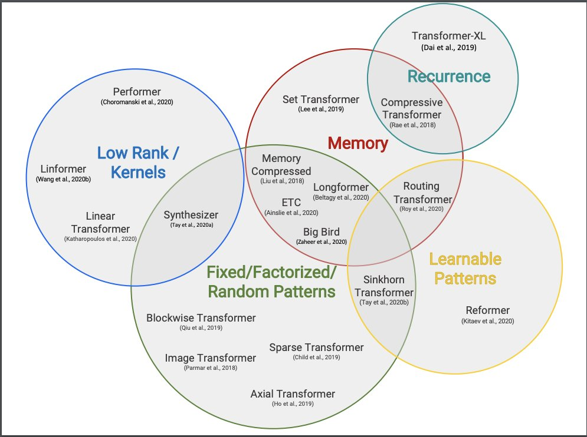
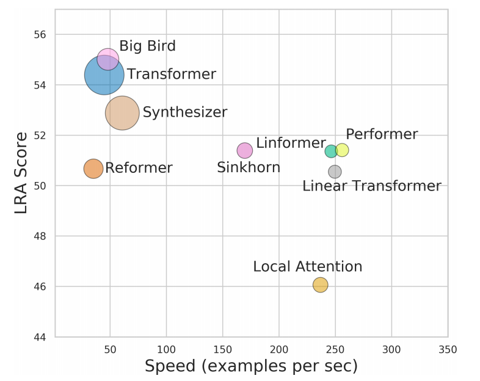

## [A Survey of Long-Term Context in Transformers](https://www.pragmatic.ml/a-survey-of-methods-for-incorporating-long-term-context)

1. Sparse Transformers
2. Adaptive Span Transformers
3. Transformer-XL
4. Compressive Transformers
5. Reformer
6. Routing Transformer
7. Sinkhorn Transformer
8. Linformer
9. Efficient Attention: Attention with Linear Complexities
10. Transformers are RNNs
11. ETC
12. Longformer

## [Efficient Transformers: A Survey](https://arxiv.org/abs/2009.06732) (Sep 2020)

| Model / Paper                        | Complexity  | Decode  | Class |
|--------------------------------------|:-----------:|:-------:|:-----:|
| Memory Compressed (Liu, 2018)        | O(n2c)      |   ✓     | FP+M  |
| Image Transformer (Parmar, 2018)     | O(n.m)      |   ✓     | FP    |
| Set Transformer (Lee, 2019)          | O(nk)       |   ✗     | M     |
| Transformer-XL (Dai, 2019)           | O(n2)       |   ✓     | RC    |
| Sparse Transformer (Child, 2019)     | O(n√n)      |   ✓     | FP    |
| Reformer (Kitaev, 2020)              | O(n log n)  |   ✓     | LP    |
| Routing Transformer (Roy, 2020)      | O(n log n)  |   ✓     | LP    |
| Axial Transformer (Ho, 2019)         | O(n√n)      |   ✓     | FP    |
| Compressive Transformer (Rae, 2020)  | O(n2)       |   ✓     | RC    |
| Sinkhorn Transformer (Tay, 2020b)    | O(b2)       |   ✓     | LP    |
| Longformer (Beltagy, 2020)           | O(n(k + m)) |   ✓     | FP+M  |
| ETC (Ainslie, 2020)                  | O(n2 + nn)  |   ✗     | FP+M  |
| Synthesizer (Tay, 2020a)             | O(n2)       |   ✓     | LR+LP |
| Performer (Choromanski, 2020)        | O(n)        |   ✓     | KR    |
| Linformer (Wang, 2020b)              | O(n)        |   ✗     | LR    |
| Linear Transformers (Katharop, 2020) | O(n)        |   ✓     | KR    |
| Big Bird (Zaheer, 2020)              | O(n)        |   ✗     | FP+M  |

- FP = Fixed Patterns or Combinations of Fixed Patterns
- M  = Memory
- LP = Learnable Pattern
- LR = Low Rank
- KR = Kernel
- RC = Recurrence.
- n = the sequence length
- b = the local window (or block) size.

## [Long Range Arena: A Benchmark for Efficient Transformers](https://arxiv.org/abs/2011.04006) (Nov 2020)

Deep Mind recently came out with Long Range Arena, a benchmark suite to pit Efficient Transformers against each other in Long Range Tasks.

[twitt](https://twitter.com/cgarciae88/status/1327382406886813712)

## High Performance NLP (Nov 2020)

Charla en el conferencia EMNLP 2020.

- [Diapositivas en PDF](http://gabrielilharco.com/publications/EMNLP_2020_Tutorial__High_Performance_NLP.pdf) (274 páginas)
- [Video en slideslive](https://slideslive.com/38940826) (3 horas de video)

---

## RASA

- [ConveRT blog](https://blog.rasa.com/efficient-sentence-representations-in-rasa)
- [ConveRT paper](https://arxiv.org/abs/1911.03688): Efficient and Accurate Conversational Representations from Transformers
- [DIET blog](https://blog.rasa.com/introducing-dual-intent-and-entity-transformer-diet-state-of-the-art-performance-on-a-lightweight-architecture/)

## [Current Limitations of Language Models: What You Need is Retrieval](https://arxiv.org/abs/2009.06857)

- Classifies & analyzes LM approaches
- Some limitations on efficient attn, recurrence, scaling up model size etc
- Retrieval may solve them
- Speculates how to extend MARGE to GPT-3

## Funnel-Transformer: Filtering out Sequential Redundancy for Efficient Language Processing
A transformer model leveraging ideas from regular CNNs (pooling the hidden states after a block of n layers), ELECTRA pretraining and Transformer-XL positional attention.

With the compression of those hidden states, the model outperforms comparable transformers with fewer FLOPs and still works for tasks that require token-level predictions (with a head a bit like a UNet that upsamples the compressed hidden states).

- https://huggingface.co/funnel-transformer
- https://arxiv.org/abs/2006.03236
