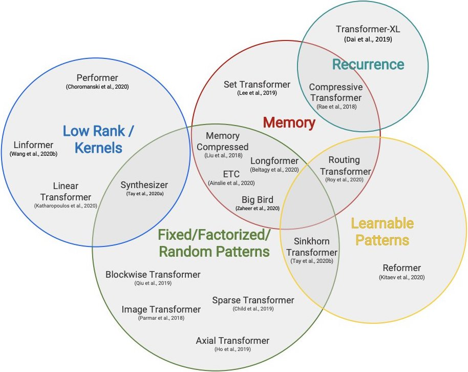

## [Notebook Transformer from scrath](https://colab.research.google.com/drive/1swXWW5sOLW8zSZBaQBYcGQkQ_Bje_bmI)
- In Pytorch
- With PyTorchLightning training loop
- Both Encoder and decoder
- [twitt](https://twitter.com/full_stack_dl/status/1349156930518859780)

## SOURCE 1 [A Survey of Long-Term Context in Transformers](https://www.pragmatic.ml/a-survey-of-methods-for-incorporating-long-term-context)

1. Sparse Transformers
2. Adaptive Span Transformers
3. Transformer-XL
4. Compressive Transformers
5. Reformer
6. Routing Transformer
7. Sinkhorn Transformer
8. Linformer
9. Efficient Attention: Attention with Linear Complexities
10. Transformers are RNNs
11. ETC
12. Longformer

## SOURCE 2 [Efficient Transformers: A Survey](https://arxiv.org/abs/2009.06732) (Sep 2020)

| Date     | Model                                         | Links                                     | Complexity | Decode | Class |
|:--------:|:----------------------------------------------|:------------------------------------------|:----------:|:------:|:-----:|
| Jan 2018 | **Memory Compressed**                         | [paper](https://arxiv.org/abs/1801.10198) | O(n2c)     |    ✓   | FP+M  |
| Feb 2018 | **Image Transformer**                         | [paper](https://arxiv.org/abs/1802.05751) | O(n.m)     |    ✓   | FP    |
| Oct 2018 | **Set Transformer**                           | [paper](https://arxiv.org/abs/1810.00825) | O(nk)      |    ✗   | M     |
| Jan 2019 | **Transformer-XL**                            | [paper](https://arxiv.org/abs/1901.02860) | O(n2)      |    ✓   | RC    |
| Apr 2019 | **Sparse Transformer**                        | [paper](https://arxiv.org/abs/1904.10509) | O(n√n)     |    ✓   | FP    |
| Nov 2019 | **Compressive Transformer**                   | [paper](https://arxiv.org/abs/1911.05507) | O(n2)      |    ✓   | RC    |
| Dec 2019 | **Axial Transformer**                         | [paper](https://arxiv.org/abs/1912.12180) | O(n√n)     |    ✓   | FP    |
| Jan 2020 | **Reformer**                                  | [paper](https://arxiv.org/abs/2001.04451) | O(n log n) |    ✓   | LP    |
| Feb 2020 | **Sinkhorn Transformer**                      | [paper](https://arxiv.org/abs/2002.11296) | O(b2)      |    ✓   | LP    |
| Mar 2020 | **Routing Transformer**                       | [paper](https://arxiv.org/abs/2003.05997) | O(n log n) |    ✓   | LP    |
| Apr 2020 | **Longformer**                                | [paper](https://arxiv.org/abs/2004.05150) | O(n(k+m))  |    ✓   | FP+M  |
| Apr 2020 | **ETC**: Encoding Long and Structured Inputs  | [paper](https://arxiv.org/abs/2004.08483) | O(n2 + nn) |    ✗   | FP+M  |
| May 2020 | **Synthesizer**                               | [paper](https://arxiv.org/abs/2005.00743) | O(n2)      |    ✓   | LR+LP |
| Jun 2020 | **Linformer**                                 | [paper](https://arxiv.org/abs/2006.04768) | O(n)       |    ✗   | LR    |
| Jun 2020 | **Linear Transformer**                        | [paper](https://arxiv.org/abs/2006.16236) | O(n)       |    ✓   | KR    |
| Jul 2020 | **Big Bird**                                  | [paper](https://arxiv.org/abs/2007.14062) [video](https://youtu.be/WVPE62Gk3EM) | O(n)       |    ✗   | FP+M  |
| Sep 2020 | **Performer**                                 | [paper](https://arxiv.org/abs/2009.14794) | O(n)       |    ✓   | KR    |
| Jan 2021 | **Switch Transformer**: Efficient Sparsity    | [paper](https://arxiv.org/abs/2101.03961) |            |        |       |
| Feb 2021 | **Nyströmformer**                             | [paper](https://arxiv.org/abs/2102.03902) |            |        |       |
| May 2021 | Apple's **AFT**: Attention Free Transformer   | [paper](https://arxiv.org/abs/2105.14103) |            |        |       |
| xxx xxxx | **RWKV**: RNN with Transformer performance    | [github](https://github.com/BlinkDL/RWKV-LM) |         |        |       |
| Jun 2022 | **RMT** 1.0: Recurrent Memory Transformer     | [paper](https://arxiv.org/abs/2207.06881) |            |        |       |
| Apr 2023 | **RMT** 2.0: Scaling Transformer to 1M tokens | [paper](https://arxiv.org/abs/2304.11062) [video](https://youtu.be/4Cclp6yPDuw) | | | |

- FP = Fixed Patterns or Combinations of Fixed Patterns
- M  = Memory
- LP = Learnable Pattern
- LR = Low Rank
- KR = Kernel
- RC = Recurrence.
- n = the sequence length
- b = the local window (or block) size.

## SOURCE 3 [Long Range Arena: A Benchmark for Efficient Transformers](https://arxiv.org/abs/2011.04006) (Nov 2020)

Deep Mind recently came out with Long Range Arena, a benchmark suite to pit Efficient Transformers against each other in Long Range Tasks.
**Sizes of circles = Memory footprint**.

[twitt](https://twitter.com/cgarciae88/status/1327382406886813712)

## OTHER SOURCES
- https://huggingface.co/blog/long-range-transformers
- High Performance NLP (Nov 2020): Charla en el conferencia EMNLP 2020.
  - [Diapositivas en PDF](http://gabrielilharco.com/publications/EMNLP_2020_Tutorial__High_Performance_NLP.pdf) (274 páginas)
  - [Video en slideslive](https://slideslive.com/38940826) (3 horas de video)

---

# Models in detail
  
## Image transformer: An Image is Worth 16x16 Words

- [illustrated blog](https://amaarora.github.io/2021/01/18/ViT.html)
  - [twitt](https://twitter.com/amaarora/status/1351313539151982594)
- [Yannic Kilcher video](https://www.youtube.com/watch?v=TrdevFK_am4)
- [Arxiv paper](https://arxiv.org/abs/2010.11929)

## Big Bird
- https://huggingface.co/blog/big-bird

## Switch Transformers
- [blog](https://syncedreview.com/2021/01/14/google-brains-switch-transformer-language-model-packs-1-6-trillion-parameters/)
- [Arxiv paper](https://arxiv.org/abs/2101.03961)
- [twitt](https://twitter.com/barret_zoph/status/1348832181980811265)

## RWKV

- RWKV is an RNN with Transformer-level LLM performance
- inspired by Apple’s AFT
- great performance
- fast training and inference
- saves VRAM
- "infinite" context len
- free sentence embedding
- they are training on the Pile, and after that, they are planning on finetune using the dataset of Yannick Kilcher and the Open Assistant team.

#### Links

- [Github repo](https://github.com/BlinkDL/RWKV-LM)
- [Overview](https://johanwind.github.io/2023/03/23/rwkv_overview.html)
- [Details](https://johanwind.github.io/2023/03/23/rwkv_details.html)
- [RWKV_in_150_lines.py](https://github.com/BlinkDL/ChatRWKV/blob/main/RWKV_in_150_lines.py)
- https://forums.fast.ai/t/rwkv-the-generative-lm-that-could-help-rnns-make-a-comeback/103595/4

---

## RASA

- [ConveRT blog](https://blog.rasa.com/efficient-sentence-representations-in-rasa)
- [ConveRT paper](https://arxiv.org/abs/1911.03688): Efficient and Accurate Conversational Representations from Transformers
- [DIET blog](https://blog.rasa.com/introducing-dual-intent-and-entity-transformer-diet-state-of-the-art-performance-on-a-lightweight-architecture/)

## [Current Limitations of Language Models: What You Need is Retrieval](https://arxiv.org/abs/2009.06857)

- Classifies & analyzes LM approaches
- Some limitations on efficient attn, recurrence, scaling up model size etc
- Retrieval may solve them
- Speculates how to extend MARGE to GPT-3

## Funnel-Transformer: Filtering out Sequential Redundancy for Efficient Language Processing
A transformer model leveraging ideas from regular CNNs (pooling the hidden states after a block of n layers), ELECTRA pretraining and Transformer-XL positional attention.

With the compression of those hidden states, the model outperforms comparable transformers with fewer FLOPs and still works for tasks that require token-level predictions (with a head a bit like a UNet that upsamples the compressed hidden states).

- https://huggingface.co/funnel-transformer
- https://arxiv.org/abs/2006.03236
